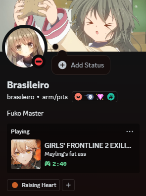

# armpitsRPC
My personal generic Discord Rich Presence application listener with a misleading name.

Listens to applications registered by the user and shows the activity on Discord.

# Usage
1. Open the application.

2. When the listener finds the targeted application running, the activity will be updated in Discord.

   > The priority of the application that will be shown is always the first one executed, so if you open application `A` and then `B`, the priority will be to show `A` activity until it is closed.

The application will try to reconnect to Discord if it is closed or opened after the targeted application, but preferably open the Discord before the targeted application.

# Add or modify an application
* Edit the `apps.json` file to add or modify any application and activity data.

* Remember to always set the `ProcessName` property without the extension.

* You can pass direct URLs to the images.

  > Each application has a unique identifier that is generated when it is created in the [Discord Developer Portal](https://discord.com/developers/applications).

# Thanks
[discord-rpc-sharp](https://github.com/Lachee/discord-rpc-csharp)

# Showcase

  

